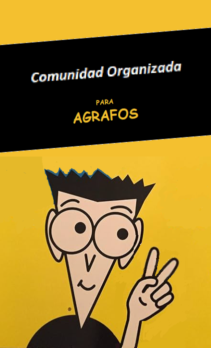

# 12 - La humanidad y el yo. Las inquietudes de la masa

En las obras de la antigua Gracia el "coro" era un grupo de actores que representaban un personaje colectivo y cantaban
al unisono. Sus intervenciones comentaban la accion y a veces interactuaban con los actores individuales. Su caracter
colectivo y anonimo le otorga al coro el papel de expresar los sentimientos de la comunidad. Euripides, un dramaturgo
de la antigua Grecia, a menudo usaba el coro en sus obras para representar la voz de la sociedad o la opinion publica.

El coro se convierte entonces en un personaje mas sobre el escenario y como tal, tiene tambien su voz. Podemos hablar, 
entonces, que junto al yo del individuo se sube al escenario otro yo: el yo de la masa, del coro, es decir, el yo de la comunidad.

Euripides pone en el escenario, en situacion de igualdad al yo del individuo junto al yo de la comunidad. El yo de la
comunidad sirve para juzgar los actos del yo del individuo, y como coro, puede expresar su opinion. Es un elemento
perfecto de medicion de la virtud de un individuo. No se trata entonces del individuo que debe enfrentar solo a 
su conciencia cuando esta en el eje vertical de su relacion con Dios, sino que debe enfrentar tambien el eje
horizontal donde es juzgado por sus pares.

Friedrich Wilhelm Heinrich Alexander von Humboldt, conocido como Alexander von Humboldt fue un polimata (una persona
con una sabiduria que abarca conocimientos diversos de la ciencia, el arte y las humanidades), geografo, astronomo,
humanista, naturalista y explorador prusiano. Es reconocido por su vision integral de la naturaleza y la humanidad.
Su enfoque integrador consideraba a la naturaleza y a los seres humanos como partes de un todo interconectado.

Humboldt expuso una vision de la sociedad en la que cada individuo es valorado y tiene la oportunidad de alcanzar
su maximo potencial. Este ideal se refleja como un todo del que formamos parte y constituye un ideal de humanidad.

Asi que no solo estan en el escenario el hombre como individio, Dios y la comunidad, sino que ahora tambien 
sube al escenario la naturaleza. Una naturaleza donde tambien cada individuo es importante, desde el caracol al
elefante, desde el yuyito mas humilde a la montaña mas majestuosa y es protagonista tambien el valle que se forma
entre la majestuosidad de esas montañas.

Al exponer Humboldt el ideal de humanidad aparece, en el campo historico, el ideal del hombre universal, erigido
en representante supremo de la civilizacion.

Auguste Comte fue un filosofo y pensador frances conocido por ser el fundador del positivismo y por haber dado inicio
a los estudios en sociologia. Desarrollo la filosofia positiva en un intento de remediar el (des-) orden social causado
por la Revolucion Francesa, que creia que indicaba una transicion inminente a una nueva forma de sociedad.
El positivismo es una corriente filosofica que sostiene que todo conocimiento genuino se limita a la interpretacion
de los hallazgos "positivos", es decir, reales, perceptibles sensorialmente y verificables. Segun esta postura, todo
conocimiento genuino es o bien positivo -a posteriori y derivado exclusivamente de la experiencia de los fenomenos
y de sus propiedades y relaciones- o bien verdadero por definicion, es decir, analitico y tautologico. Asi, la
informacion derivada de la experiencia sensorial, interpretada a traves de la razon y la logica, constituye la fuente
exclusiva de todo conocimiento cierto.

Para Kant las verdades a priori eran independientes de la experiencia. Para Comte, en cambio, incluso aquellos conocimientos
que parecen ser a priori como la geometria y las matematicas estan en ultima instancia basados en la experiencia
sensorial y son validados por su utilidad en la explicacion y prediccion de fenomenos empiricos.

Comte propuso que la sociedad evoluciona a traves de tres etapas: la teologica, la metafisica y la positiva. En la
etapa positiva el conocimiento cientifico, incluyendo a la sociologia, se convierte en la base para comprender
y mejorar la sociedad. Comte tambien propuso la idea de que la sociedad debia estar organizada de manera jerarquica,
con los sociologos como los encargados de guiar el proceso social. En otras palabras, Comte veia a los sociologos
como los expertos que, a traves de su comprension cientifica de la sociedad, podrian ayudar a formular politicas
efectivas.

Georg Wilhelm Friedrich Hegel, un filosofo aleman, es conocido por su filosofia del espiritu y su enfoque en la
dialectica. Hegel afirmo que el espiritu existe por si mismo y que solo puede alcanzar su plenitud cuando el yo
individual se eleva al nosotros colectivo.
En otras palabras, Hegel veia al individuo y a la sociedad como partes inseparables de un todo mayor, que el
llamaba Espiritu Absoluto.
Hegel llevo esta idea a sus ultimas consecuencias filosoficas, argumentando que el espiritu no es sustancia
sino que se hace, y se hace en su conciencia de si, mediante su saber de si mismo. Este concepto de autoconciencia
es fundamental en la filosofia de Hegel y se refiere a la capacidad del espiritu para reflexionar sobre si mismo
y comprender su propia naturaleza.
Hegel tambien sostuvo que el espiritu solo puede llegar a su pleno ser en la medida que el yo se eleve al nosotros,
o en sus palabras, al "yo de la humanidad". Esto sugiere que el desarrollo del espiritu depende de la capacidad del
individuo para trascender su propia perspectiva individual y adoptar una perspectiva mas amplia que incluya a toda
la humanidad.

Vemos, entonces, subir al escenario a otro actor importante. Junto al yo del individuo se ubica su espiritu con 
igual importancia protagonica.

> El racionalismo post-kantiano de Hegel mueve el foco de la mirada del individuo a la sociedad, desde el hombre
a la humanidad.

La Revolucion Industrial fue un periodo de cambios rapidos en la tecnologia y la economia durante el siglo XIX.
Este periodo vio el surgimiento del industrialismo y el capitalismo, sistemas economicos basados en la produccion
en masa y la propiedad privada de los medios de produccion. Estos cambios permitieron a los individuos expresar y
perseguir sus propios intereses y valores de una manera que no era posible antes. Estos cambios tambien afectaron
la forma en que las personas entendian su propia identidad y su lugar en la sociedad. En otras palabras, a medida
que la sociedad se volvia mas compleja y diversa, tambien lo hacia la comprension de lo que significa ser un
individuo dentro de esa sociedad.

> El individuo se hace interesante en funcion de su participacion en el movimiento social, y son las caracteristicas
> evolutivas de este las que requieren que se les preste la mayor atencion. Para corregir las concepciones erroneas
> de la etapa de los privilegios fue necesario desdoblar de manera implacable la fortaleza-unidad del individuo. Pero
> reconozcamos que ese cambio debe considerarse precedido de una larga etapa teorica. La practica corresponde a nuestro
> siglo y esta en sus comienzos.

> Esto tiene una explicacion hasta cierto punto sencilla. Cuando decimos que los cambios ocurridos partieron del viejo
> estado de necesidad para llegar al moderno estado de libertad, enfocandonos mas en el individuo que en la comunidad,
> damos una vision oblicua de la evolucion. La etapa preparatoria, o teorica de realizacion del yo en nosotros fue,
> cabalmente una fase apta para permitir la cesion de los principios rectores que, sin caer todavia sobre la masa,
> facilitaba a los nuevos grupos dirigentes el esperado desplazamiento del poder.

Si la libertad va a ser permanente es necesario clarificar previamente ciertos conceptos. Si hablamos de libertad
de los hombres, con su consiguiente estado de necesidad creado por aquellos miembros de la sociedad con mas poder,
entonces debemos quedar de acuerdo en que esa libertad incluye tambien la de poder rebelarse ante ese poder opresor.
La posibilidad de elegir no continuar en ese estado de opresion.

> La libertad precisa entonces que se aclaren ciertas cosas si va a ser permanente. Si por sentido de libertad entendemos
> el acervo palpitante de la humandidad, frente al estado de necesidad dictado por el imperio indiscutido de una
> fraccion electoral, debemos plantearnos inmediatamente su problema maximo: su incondicion, y sobre todo, su
> posibilidad de opcion.

Ser libre no es hacer cualquier cosa que uno tenga ganas de hacer. Esa libertad consiste no en hacer cualquier cosa
sino que es la libertad de elegir entre ciertas opciones disponibles. No se puede promulgar que existe la libertad sin tener
en cuenta a la comunidad, sin tener dispositivos que equilibren los desbalances de poder, sin moldear la cultura
para que un acto de libertad este precedido por una consulta a la conciencia.

> Ser libre no es obrar segun se tenga en gana, sino una eleccion entre varias posibilidades profundamente conocidas.
> Y tal vez, en consencuencia, veremos que promulgar ese estado de libertad no fue precedido por el dispositivo social,
> que no disminuyo las desigualdades en los medios de lucha y defensa, ni, mucho menos, por la accion cultural necesaria
> para que las posibilidades selectivas inherentes a todo acto verdaderamente libre pudiensen ser objeto de conciencia.

La democracia, esa libertad que consiste en pedir la opinion a cada miembro de la sociedad, existe desde mucho antes
de nuestra epoca. Ahora que la humanidad empieza a conseguir mayores niveles de libertad, cuando las crisis de los 
hechos empujan a una crisis de las ideas, es cuando se nota de que manera tan imperfecta nuestro
concepto de libertad y de democracia encajan, o mejor dicho, dejan de encajar, con los ideales de libertad y democracia
que heredamos de los griegos.

> El fondo que le da contenido a la libertad, la autodeterminacion popular, sobreviene a muy larga distancia en el tiempo
> del prologo politico de la cuestion. Cuando el ideal de humanidad empieza a abrirse paso, cuando la crisis de los
> hechos produce la revolucion de las ideas, vemos que los antiguos enunciados no encajan de manera perfecta con el
> signo de la evolucion. Son esbozos, o reflejos imperfectisimos, de un ideal mucho mas antiguo: el griego.
